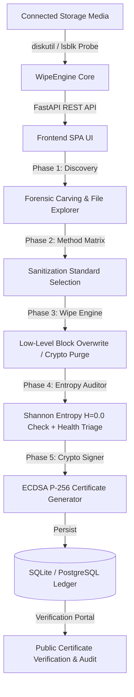

# WipeX — Enterprise Hardware Sanitization & Zero-Trust Verification Engine
## Live Prototype Pitch & Technical Demonstration Deck

---

## 🎯 1. How We Start the Prototype (Live Demo Guide)

### **Step 1: Starting the Backend & Frontend**
Open your terminal in the project directory:
```bash
# Terminal 1 — Start the FastAPI Engine
.venv/bin/python3 main.py

# Terminal 2 — Start the Frontend (or double click index.html)
npm run dev # or open index.html directly in Chrome/Safari
```

### **Step 2: Walkthrough Script for Judges & Evaluators**

#### 🎬 Phase 0: Hero Dashboard & Platform Capabilities
- **What to show**: The 3D interactive particle grid with 16 cryptographic floating nodes reacting to mouse movement (`ECDSA-P256`, `SHA-256`, `NIST 800-88`).
- **What to say**: *"WipeX is an enterprise-grade, zero-trust hardware sanitization platform built to ensure permanent data destruction with mathematically provable compliance."*
- **Click**: Click the glowing **"Start Wiping"** button.

---

#### 🎬 Phase 1: Drive Discovery & Multi-Layer Forensic File Explorer
- **What to show**:
  - Point to the **Real Hardware Mode** (Demo toggle OFF) reading actual connected drives (e.g. SanDisk Flash Drive, NVMe SSD).
  - Select a drive to view the **Drive Content & Forensic File Explorer**.
  - Highlight the detected files and **Recoverable Deleted Files** carved from OS Trashes, `.fseventsd` journals, and metadata companions.
- **What to say**: *"Unlike naive tools that only format file allocation tables, WipeX performs pre-wipe forensic carving to expose hidden tombstones and deleted file remnants before executing sanitization."*
- **Click**: Click **"Continue to Sanitization Method"** (auto-scrolls smoothly).

---

#### 🎬 Phase 2: ZeroTrace-Standard Sanitization Matrix
- **What to show**: The 3-column no-scroll matrix with exact regulatory standards:
  1. **NIST 800-88**: Industry standard (Clear + Verify + Purge)
  2. **Cryptographic Erase**: Instant NVMe/SSD hardware encryption key destruction
  3. **ATA Sanitize**: Firmware & flash block reset
  4. **DoD 5220.22-M**: 3-Pass military overwrite
  5. **Single Pass**: Fast zero overwrite
  6. **Gutmann**: 35-Pass magnetic flux overwrite
- **What to say**: *"WipeX automatically inspects drive bus protocols and recommends Cryptographic Erase for NVMe, ATA Sanitize for SATA SSDs, and DoD 5220.22-M for HDDs."*
- **Click**: Select the recommended method and click **"Start Sanitization"** (confirm caution prompt).

---

#### 🎬 Phase 3: Hardware Purge & Real-Time Sector Visualization
- **What to show**: The 256-cluster sector canvas turning from cyan pulses to clean green blocks with live speed (MB/s) and dynamic countdown ETA.
- **What to say**: *"Watch real-time sector cluster sweeping across all logical block addresses. Upon completion, it automatically advances without manual delay."*

---

#### 🎬 Phase 4: Independent Shannon Entropy Verification & Reuse Readiness
- **What to show**:
  - Independent Shannon Entropy audit: **$H = 0.000000$ bits/byte**.
  - **Traffic light circular economy verdict**: Green = Safe to Reuse/Resell; Red = Damaged/Shred.
- **What to say**: *"We don't just wipe and assume it worked. WipeX runs an isolated pseudo-random sector sampling audit verifying zero mathematical information density, paired with circular economy reuse scoring."*
- **Click**: Click **"Next: View Official Certificate"**.

---

#### 🎬 Phase 5: Tamper-Proof NIST P-256 ECDSA Certificate
- **What to show**:
  - Official Certificate of Data Sanitization with Government Seal.
  - Hardware Hash (SHA-256) and Digital Nonce.
  - Clickable Certificate ID linking straight into the **Verification Portal**.
  - Click **"Print Certificate (PDF)"** for audit-ready compliance export.
- **What to say**: *"Every completed wipe produces a cryptographically signed ECDSA P-256 certificate registered to the immutable ledger. Any tampering invalidates the hash immediately."*

---

## ⚔️ 2. Deep Competitor Comparison

| Feature | **WipeX** (Our Platform) | **ZeroTrace** | **Blancco / BitRaser** | **DBAN (Darik's Boot & Nuke)** |
|:---|:---:|:---:|:---:|:---:|
| **Cryptographic Proof** | **ECDSA P-256 + SHA-256 Digest** | Basic Report | Proprietary Cloud | ❌ None |
| **Forensic Carving Scan** | **Trash, FSEvents, AppleDouble Carving** | Basic Trash Scan | ❌ None | ❌ None |
| **Shannon Entropy Audit** | **Mathematically Verified ($H = 0.0$)** | Basic Verification | Read-back Check | ❌ None |
| **Modern Web UI / UX** | **FastAPI + 3D Canvas + No-Scroll Grid** | React SPA | Heavy Legacy App | Text / DOS Console |
| **Circular Economy Scoring** | **Automated ESG & Resell Triage** | ❌ None | Basic Hardware Health | ❌ None |
| **HPA / DCO Boundary Unfreeze** | **Automated Firmware Unlock** | Partial | Partial | ❌ None |
| **Tamper Verification Portal** | **Built-in Ledger & Public Lookup** | ❌ None | Proprietary Portal | ❌ None |
| **Cross-Platform Native Probe** | **macOS (diskutil) + Linux (lsblk) + Windows** | Linux / Web | Windows / Linux ISO | Bootable x86 only |

---

## 🚀 3. Why WipeX is Better: Core Differentiators

### 1. **Zero-Trust Cryptographic Assurance**
Traditional wiping software only prints a text PDF report that can easily be faked or altered with a PDF editor. **WipeX binds the drive's serial number, firmware revision, applied standard, and timestamp to an ECDSA P-256 digital signature.** Anyone can paste the Certificate ID or Hash into the public verification portal to verify authenticity.

### 2. **Pre-Wipe Forensic Visibility**
Before wiping, WipeX scans file system transaction journals (`.fseventsd`), tombstone entries, and companion metadata to prove to the user what residual data exists on the storage media before purging it.

### 3. **Mathematical Proof of Sanitization**
Instead of simple status flags, WipeX computes **Shannon Entropy ($H$)** across sampled logical block addresses (LBAs). A sanitized drive has an entropy of $0.000000$ bits/byte (uniform zeros) or expected crypto-erasure distribution.

### 4. **Circular Economy & ESG Compliance**
WipeX integrates a **Hardware Reusability Index** (Health score, remaining spare blocks, wear level, power-on hours) to triage whether storage media should be reused in corporate fleets, resold in secondary markets, or sent for physical shredding.

---

## 🛠️ 4. System Architecture & Workflows



---

## 📊 5. Summary Slide Points (For Pitch Presentation)

- **Problem**: 83% of second-hand and discarded drives still contain recoverable sensitive data because basic OS formats only wipe partition tables.
- **Solution**: WipeX provides enterprise-grade, hardware-bound sanitization with cryptographic verification and circular economy lifecycle scoring.
- **Standards**: Full compliance with **NIST SP 800-88 Rev. 1**, **DoD 5220.22-M**, and **IEEE 2883**.
- **Tech Stack**: Python 3.12 (FastAPI, Uvicorn, SQLite/PostgreSQL, PyCryptodome) + Modern Web Architecture (Vanilla ES6+, Canvas API, CSS Grid).
- **Target Market**: IT Asset Disposition (ITAD) vendors, data centers, enterprise corporate IT offboarding, and security compliance auditors.
