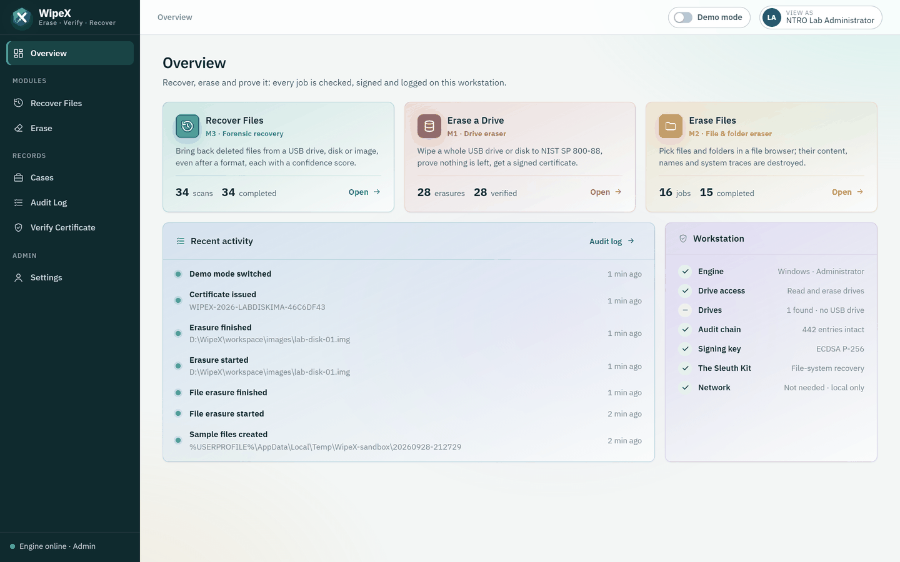
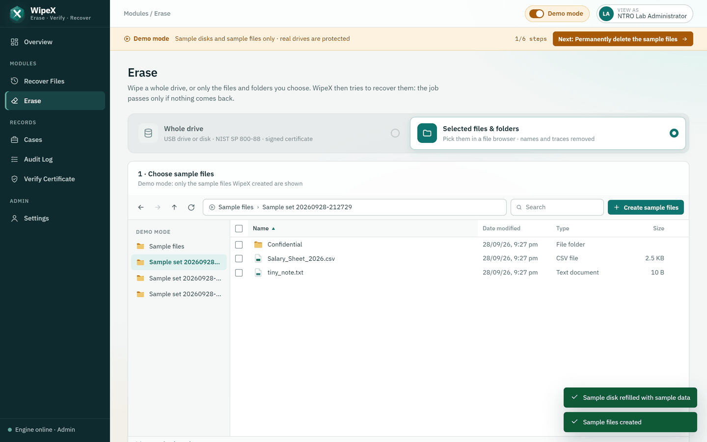
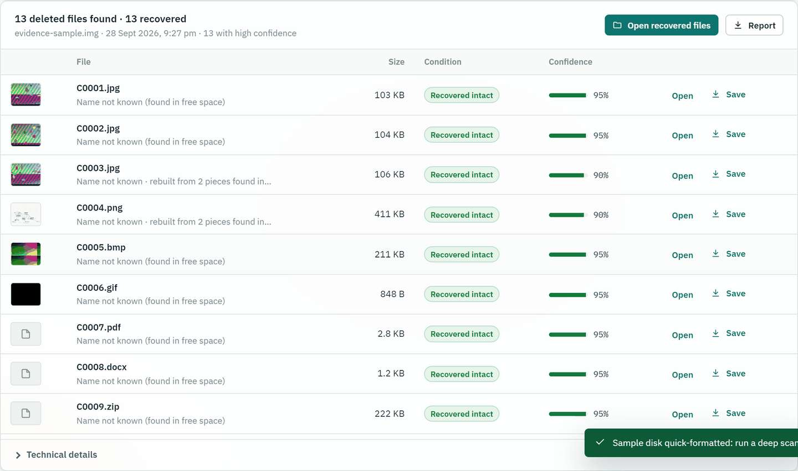
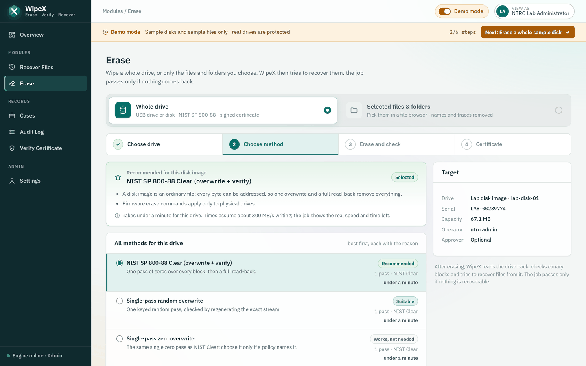
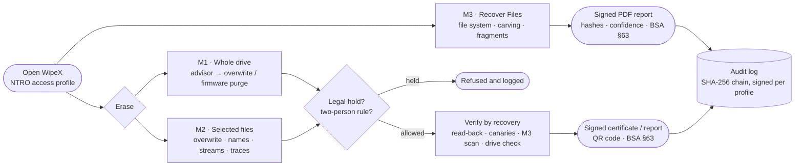

<p align="center"></p>

<h1 align="center">WipeX</h1>

<p align="center"><b>Integrated Secure Data Erasure &amp; Forensic Recovery</b><br>
Smart India Hackathon 2026 · <b>SIH26149</b> · National Technical Research Organisation (NTRO)<br>
Blockchain &amp; Cybersecurity · Software</p>

<p align="center"><a href="https://github.com/luvanshiscoding/WipeX/actions/workflows/tests.yml"></a></p>

> *Recover what must be preserved as evidence. Erase what must never be recovered. Prove both.*

WipeX is one offline workstation application with the three modules SIH26149 asks for: a **drive eraser** (M1), a **file and folder eraser** (M2) and a **file carving and recovery** engine (M3). They share cases, role-based access, a signed audit log and signed reports. The key idea: **every erasure is verified by WipeX's own recovery engine**. A job passes only if nothing can be brought back.

| At a glance | |
|---|---|
| Recovery accuracy | 13 of 13 carvable files, **0 false positives**, 3 fragmented files rebuilt byte-exact; files come back **after a quick format**; every file gets a **confidence score** |
| Erasure proof | After NIST Clear: 0 of 16 canary blocks and 0 files recoverable; a deliberately incomplete wipe is **rejected** |
| File deletion | FAT32 normal delete: 10 names and 8 files recoverable → after WipeX: **nothing** (checked by reading the drive directly) |
| Safety | System disk always refused · legal holds · two-person rule · links and junctions never followed · demo mode that cannot touch a real drive |
| Runs on | Windows 10/11, Linux, macOS · **no network needed** (automated test blocks every connection) |
| Quality | 53 automated tests on Windows, Linux and macOS (GitHub Actions) |

---

## 1. The problem and how WipeX answers it

Agencies must both **permanently destroy** sensitive data and **recover deleted evidence**, and today they use separate tools for each. SIH26149 asks for one integrated tool.

| Requirement | What WipeX does |
|---|---|
| **M1 · Drive eraser** for HDD, SSD, USB, memory cards | NIST SP 800-88 overwrite (1, 3 or 35 passes, keyed random) and firmware purge (NVMe Sanitize, ATA Security Erase, TCG Opal PSID revert). A **method advisor** ranks all eight methods for the selected drive and says why: USB sticks get one verified pass (firmware commands cannot pass the USB bridge), NVMe gets crypto erase, a failing drive gets a destroy warning |
| Verification and compliance | Full read-back against the expected pattern, canary blocks, then an **M3 recovery attempt** on the erased media → ECDSA-signed certificate (PDF with QR code) and a draft BSA 2023 §63 annexure |
| **M2 · File and folder eraser** with metadata removal | Pick files in an Explorer/Finder-style browser → content overwritten, names scrambled, timestamps reset, NTFS alternate data streams and extended attributes removed, deleted directory entries reused (FAT/exFAT), OS traces cleaned (Recent items, Jump Lists, thumbnails, Finder metadata), NTFS change journal cleared → a **drive check** reads the volume directly and looks for the original names and content |
| **M3 · Recovery** from damaged or formatted media, several techniques | (1) file-system metadata with The Sleuth Kit, including files inside deleted folders; (2) signature carving with full structural validation of 8 format families; (3) fragment rebuild for JPEG, PNG and ZIP, accepted only when the format's own checksum or decoder agrees; each file gets a **confidence score**. Sources: USB drive or disk by letter, one folder, raw image, **E01** evidence |
| Multiple file systems and devices | NTFS, FAT12/16/32, exFAT, ext2/3/4, HFS+, ISO 9660 (read); APFS, Btrfs, ReFS detected and rated honestly; HDD, SATA/NVMe SSD, USB sticks, memory cards, Android (ADB) |
| Audit, reporting, dashboard | SHA-256 hash-chained audit log signed by the workstation **and** the acting profile; PDF reports for every job; dashboard with four NTRO roles |
| Performance evaluation | Built-in benchmark: recall, precision and throughput against ground truth (raw and E01) |

## 2. What sets WipeX apart

- **Erasure proven by recovery.** Other tools write zeros and trust it. WipeX then attacks its own result with the M3 engine: the job passes only if the read-back matches, every canary is gone and nothing is recoverable. When the drive cannot be read directly, the report says so instead of claiming a pass.
- **The SSD trap handled.** WipeX detects SSDs, TRIM and copy-on-write file systems. It rates file-level deletion there as *Limited* or *Not effective* and points to a whole-drive purge. It does not pretend that overwriting a file on flash is enough.
- **Deleted names really gone.** FAT and exFAT (most USB sticks) keep a deleted file's name. WipeX reuses those entries and reads the drive back to prove it.
- **Fragmented and formatted media.** Split photos are rebuilt by checking the JPEG image data itself. After a quick format, carving still returns the files byte-exact, each with a confidence score.
- **Evidence cannot be destroyed by accident.** Legal holds block erasure of case devices and folders. The two-person rule adds a second, signed approval. Symbolic links and junctions are removed as links and never followed.
- **Attributable and offline.** Each NTRO access profile has its own ECDSA key. The engine accepts requests from this computer only, and nothing is fetched from the internet.

## 3. Try it in five minutes

```bash
pip install -r requirements.txt     # FastAPI, cryptography, pytsk3 (The Sleuth Kit), ReportLab, Pillow
npm install && npm run build        # builds the UI into dist/ (fonts bundled, no CDN)
python wipex.py                     # opens WipeX on http://127.0.0.1:8000  (--window: own desktop window)
```

Reading and erasing drives needs Administrator rights (Windows) or root (macOS, Linux), so WipeX **asks once when it starts**: the UAC prompt on Windows, the password in a terminal elsewhere. Double-clicking **`WipeX.cmd`** (Windows) or **`WipeX.command`** (macOS) does the same. If WipeX runs without them, a red bar offers **Restart as Administrator**; the page reconnects by itself.

**Open WipeX from a link, with no prompt.** Run once with the rights: `python wipex.py --install` (Windows: approve the prompt; macOS / Linux: `sudo python3 wipex.py --install`), or switch it on in *Settings*. WipeX then starts with the rights at every Windows sign-in (scheduled task "run with highest privileges") or at boot (macOS LaunchDaemon, Linux systemd), and users open **http://127.0.0.1:8000/** from a bookmark or the desktop shortcut. `--uninstall` removes it.

WipeX opens straight into the **NTRO Lab Administrator** profile; there is no sign-in page for evaluators. *View as* (top right) switches to the Forensic Investigator, Sanitization Officer or Auditor profile, and the menu then shows only what that role may do.

**Demo mode (no pendrive needed).** Switch on **Demo mode** in the top bar. Every screen then shows only sample disks and sample files, and the engine refuses anything else. The Overview lists six steps, ticked from the audit log:

1. **Recover Files** → sample disk → *Deep scan*: deleted files return, including rebuilt fragments. Then *Quick-format this disk* and scan again: the files still come back, with confidence scores.
2. **Erase → Selected files & folders** → *Create sample files* → *Permanently delete* → *no trace found*.
3. **Erase → Whole drive** → `lab-disk-01`: the recommended method is preselected with its reasons → read-back, canary and recovery checks.
4. **Issue certificate** → PDF with QR code.
5. **Verify Certificate** → authentic.
6. **Audit Log** → chain intact.

**With a USB pendrive** (demo mode off, any FAT32, exFAT or NTFS stick whose contents you do not need):

| Step | Where | Result |
|---|---|---|
| 1 | Copy photos and documents to the stick, delete them in Explorer / Finder | They look gone |
| 2 | **Recover Files** → the stick (USB drives listed first) → *Deep scan* | They come back, by name, with condition and confidence |
| 3 | **Erase → Selected files & folders** → tick a folder on the stick → *Review* → *Permanently delete* | *Permanently deleted: no trace found* |
| 4 | **Recover Files** → scan again | The erased files do not come back |
| 5 | **Erase → Whole drive** → the stick → *NIST 800-88 Clear* (recommended) | Verified → signed certificate → *Format for reuse* |
| 6 | **Verify Certificate** · **Audit Log** | Certificate authentic · chain intact |

Explorer or an antivirus scan holding the stick open is handled: WipeX dismounts the volume and then locks it. A stick with no drive letter (erased, formatted, or with a damaged file system) is listed under *Whole USB drives* in Recover Files and read block by block; press **Rescan** after plugging one in.

## 4. Screenshots

| | |
|---|---|
|  **Overview**: the three modules, recent activity, workstation status |  **Erase → Selected files**: Explorer-style browser, sample files in demo mode |
|  **Recovery after a quick format**, with confidence scores |  **Erase → Whole drive**: every method ranked for this drive, with the reason and the time |

Every job produces a PDF: a [sample certificate](docs/images/certificate.png) with the verification evidence, integrity hash and QR code, followed by a draft BSA 2023 §63 annexure.

## 5. Measured results

**Recovery** (64 MB FAT16 lab image, 14 planted files, matched by SHA-256 against ground truth):

| Technique | Result |
|---|---|
| File system (The Sleuth Kit) | 6 of 7 deleted files intact (the 7th is reported as damaged: its clusters were reused) |
| Carving | 13 of 13 carvable files, **0 false positives**; 3 fragmented files (PNG, ZIP, JPEG) rebuilt byte-exact; 80–140 MB/s across runs |
| Combined | **9 of 9** deleted and orphaned files; the same from an E01 container |
| After a quick format | The file system lists nothing; carving returns every photo and document byte-exact |
| Real drives (Windows, virtual USB disks) | A folder of 6 files deleted by Windows: 6 of 6 recovered **by name** on FAT32, exFAT and NTFS |

**Deleting files for good** (the same folder deleted normally, then with WipeX; the volume read directly with The Sleuth Kit):

| Volume | Normal delete leaves | After WipeX |
|---|---|---|
| FAT32 (Windows and Linux) | 10 names, 8 files recoverable | nothing |
| exFAT (Linux) | 10 names, 8 files recoverable | nothing |
| NTFS (Windows) | 1 name, 38 change-journal records | nothing |
| ext4 (Linux) | nothing visible | nothing |

**Erasure and speed** (Windows 11): after NIST Clear, DoD 3-pass and a random pass, 0 of 16 canaries and 0 files are recoverable. A 512 MB drive held open by another program is erased and verified in 9.7 s. Deleting sample files on the 222 GB system drive, including the drive check, takes 31 s; on a USB stick 1–2 s. For a whole drive, the method advisor estimates the time before starting (a 32 GB stick at 20 MB/s: about 30 min for NIST Clear).

## 6. Architecture

```
 web/   vanilla-JS UI served by the engine; own desktop window (pywebview) or any local browser
        Overview · Recover Files · Erase (whole drive | selected files) · Cases · Audit Log · Verify Certificate
                                 │  REST / JSON · 127.0.0.1 only · one session per NTRO access profile
 engine/main.py  FastAPI ────────┼─────────────────────────────────────────────────────────────────────
   erasure.py · advisor.py · hw_sanitize.py   M1  overwrite / firmware purge, method advice, read-back, certificates
   file_eraser.py                             M2  storage assessment, overwrite, metadata and trace removal, drive check
   recovery/  (fs_recovery, carver, jpeg_frag) M3  The Sleuth Kit, validated carving, fragment rebuild, confidence
   cases.py · users.py · audit_log.py         shared: cases, E01 acquisition, legal holds, roles, signed hash chain
   reports.py · benchmark.py · demo.py        PDF reports + BSA §63 annexure, accuracy benchmark, demo mode
                                 │
 SQLite · workspace/ (images, evidence, recovered files, reports) · keys/        all local, git-ignored
```



Design details: [docs/SPECIFICATION.md](docs/SPECIFICATION.md) · desktop packaging: [docs/DESKTOP_APP_PLAN.md](docs/DESKTOP_APP_PLAN.md)

## 7. Platform support

| Capability | Windows 10/11 | Linux | macOS |
|---|---|---|---|
| Overwrite erasure of disks, USB drives, images | ✅ Administrator | ✅ root | ✅ root |
| Firmware purge (NVMe Sanitize, ATA, Opal) | 🟡 NVMe, Opal | 🟡 nvme-cli, hdparm, sedutil | — |
| File erasure with streams / xattrs and OS traces | ✅ | ✅ | ✅ |
| Drive check after file erasure | ✅ NTFS, FAT32, exFAT | ✅ ext4, FAT32, exFAT, NTFS | 🟡 HFS+, FAT, exFAT |
| Recovery (Sleuth Kit + carving + E01) from USB drives | ✅ by drive letter | ✅ lsblk | ✅ diskutil (APFS cannot be read directly) |
| Format for reuse | exFAT, FAT32, NTFS | exFAT, FAT32, NTFS | exFAT, FAT32 |
| Launcher · network needed | `WipeX.cmd` · none | `sudo python3 wipex.py` · none | `WipeX.command` · none |

✅ implemented and tested · 🟡 implemented, awaiting validation on sacrificial hardware · — not offered (WipeX explains why). The test suite passes on Windows 11 and Ubuntu, and in GitHub Actions on Windows, Ubuntu and macOS. It has not yet been run on a physical Mac. Every firmware purge is followed by the same independent read-back, so a purge that silently did nothing fails verification.

## 8. Security and responsible use

WipeX is dual-use: recovery is for **authorised forensic examination** only, and erasure must never destroy evidence. It enforces this with:

- role-based NTRO access profiles, each with its own signing key;
- legal holds;
- the two-person rule, with a signed approval by a second profile;
- a hash-chained audit log signed per profile;
- an API that rejects requests from any other computer.

The system disk, system folders, user-profile folders and WipeX itself are always refused. The prototype opens without a sign-in page for evaluators. The same engine supports named accounts with scrypt-hashed passwords for deployment (`/api/auth/login`, `/api/users`).

Tests: `python -m unittest discover -s tests -v`. They cover recovery accuracy, fragment rebuild, recovery after a format, erasure verification (an incomplete wipe must fail), tamper detection, roles, legal holds, E01, demo-mode refusals, link safety, the method advisor, and a run of every module with the network blocked.

## 9. Limitations and roadmap

- File-level overwrite cannot reach an SSD's spare blocks. WipeX says so and recommends a whole-drive purge.
- APFS, Btrfs, ReFS and ZFS (copy-on-write) cannot be read directly by The Sleuth Kit.
- Not detected yet: a JPEG split by another photo without restart markers.
- Before the Grand Finale: benchmark on public data sets (DFRWS, NIST CFReDS); validate firmware purges on sacrificial drives; test on a physical Mac; build installers and a bootable USB; add real sign-in for production.

## 10. Standards

NIST SP 800-88 Rev. 2 (media sanitization) · IEEE 2883-2022 (sanitizing storage) · NIST SP 800-86 (forensic techniques) · TCG Opal 2.0 · DoD 5220.22-M (legacy pattern) · Bharatiya Sakshya Adhiniyam 2023 §63 (electronic records) · Digital Personal Data Protection Act 2023.

Built with The Sleuth Kit (pytsk3), FastAPI, cryptography, ReportLab, Pillow and qrcode-generator; fonts are IBM Plex (SIL OFL). Firmware tools (nvme-cli, hdparm, sedutil-cli) are called when present, not bundled.
