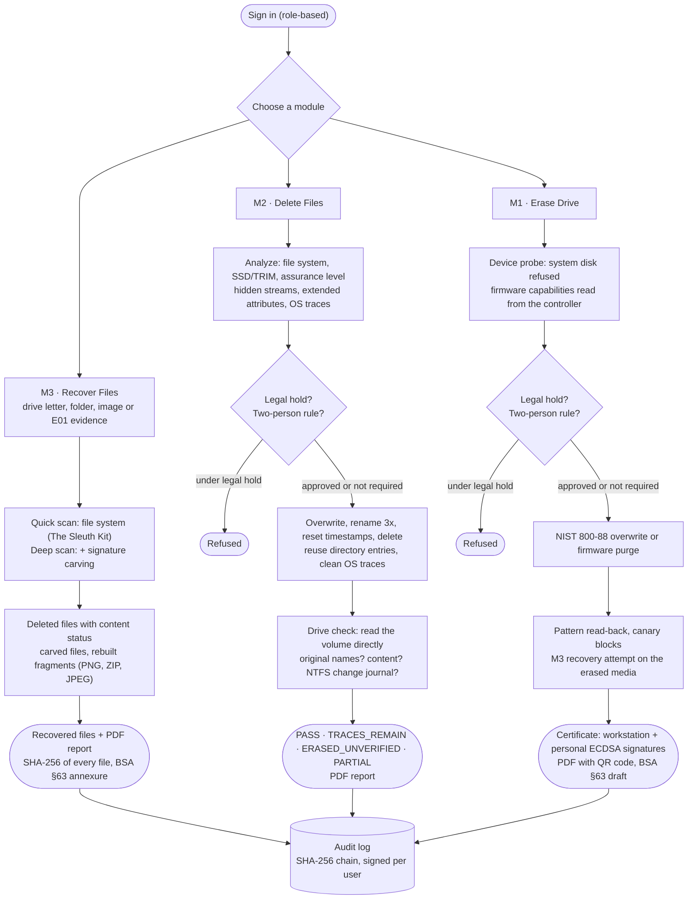

# WipeX — Integrated Secure Data Erasure & Forensic Recovery

**Smart India Hackathon 2026 · Problem Statement SIH26149 · National Technical Research Organisation (NTRO)**
**Theme:** Blockchain & Cybersecurity · **Category:** Software

[](https://github.com/luvanshiscoding/WipeX/actions/workflows/tests.yml)

> *Recover what must be preserved as evidence. Erase what must never be recovered. Prove both.*

WipeX is one offline workstation application with three modules: a secure **drive eraser**, a secure **file and folder eraser**, and a **file carving and recovery** engine. They share case management, role-based sign-in, a tamper-evident audit log and signed reports. It runs on Windows, Linux and macOS, needs no network connection, and every erasure is verified by trying to recover data from the erased media.

---

## 1. Problem statement

> *"Design and Development of an Integrated Secure Data Erasure and Advanced File Recovery Tool for Digital Forensics and Data Sanitization"*

Agencies must both **permanently destroy** sensitive data and **recover deleted evidence**. Today these are separate tools. SIH26149 asks for one integrated tool:

| # | Required module | Expected capability |
|---|---|---|
| M1 | Secure Drive Eraser | Sanitize various storage types, with verification and compliance reporting |
| M2 | Secure File & Folder Eraser | Selective deletion of files and folders with **metadata removal**, across file systems |
| M3 | Advanced File Carving & Recovery | Restore deleted files from damaged or formatted media using multiple techniques |

Also required: audit logging, reporting, a dashboard, support for multiple devices and file systems, technical documentation and **performance evaluation**.

## 2. How WipeX meets each requirement

| Requirement | WipeX implementation | Status |
|---|---|---|
| Drive erasure for various storage types | NIST SP 800-88 Clear overwrites (1 / 3 / 35 pass, keyed random) and Purge through the drive's own controller: NVMe Sanitize (crypto / block erase), ATA Security Erase, TCG Opal PSID revert | ✅ overwrite · 🟡 firmware purge (see §5) |
| Verification | Full read-back against the expected pattern, canary blocks, and a **recovery attempt** by M3 on the erased media | ✅ |
| Compliance reporting | ECDSA-signed certificate (JSON + PDF + QR), BSA 2023 §63 annexure draft | ✅ |
| File and folder erasure with metadata removal | In-place overwrite, random renames, timestamp scrub, NTFS alternate data streams, Linux/macOS extended attributes, reuse of the directory entries that held the names (FAT/exFAT keep deleted names), OS trace cleanup (Recent items, Jump Lists, thumbnails, Finder metadata, download records), optional clearing of the NTFS change journal; afterwards a **drive check** reads the volume directly for the original names and content | ✅ |
| Multiple file systems | NTFS, FAT/exFAT, ext2/3/4, HFS+, APFS/Btrfs/ReFS detection; Sleuth Kit parsing for NTFS, FAT, exFAT, ext, HFS+, ISO 9660 | ✅ |
| Recovery with multiple techniques | (1) file-system metadata via The Sleuth Kit, (2) signature carving with full structural validation of 8 format families, (3) fragment reassembly for PNG, ZIP and JPEG | ✅ |
| Damaged / formatted media, evidence formats | Any drive or USB stick by drive letter (whole drive or one folder), raw images, raw devices (read-only) and **E01 (Expert Witness)** images; evidence acquisition to raw or E01 with SHA-256 + MD5 | ✅ |
| Audit logging | SHA-256 hash chain; every entry signed by the workstation key **and** the signed-in user's personal key | ✅ |
| Dashboard and multi-user operation | Web UI (desktop window or browser) with sign-in and four roles: Administrator, Investigator, Sanitizer, Auditor | ✅ |
| Performance evaluation | Built-in benchmark: recall, precision and throughput against ground truth, for raw and E01 images | ✅ lab image · planned: public datasets |

## 3. What sets WipeX apart

- **Verification by recovery.** After erasing, WipeX runs its own recovery engine against the media. A drive erasure passes only if the pattern read-back matches, every canary block is gone and nothing can be recovered. A file erasure passes only if The Sleuth Kit, reading the volume directly, finds neither the original names nor the content, and on Windows the NTFS change journal no longer names the files. When the volume cannot be read directly (no Administrator / root rights, or a copy-on-write file system), the result says so instead of claiming a pass.
- **Deleted names really gone.** FAT and exFAT, the file systems on most USB sticks and memory cards, keep a deleted file's name in its folder. WipeX reuses those directory entries and then reads the drive back. On FAT32 a normal delete left 10 of 10 names and 8 of 8 files recoverable; after WipeX, none (see §6).
- **Fragmented photos recovered.** JPEG has no checksums, so WipeX checks the compressed image data itself: every code must be valid and the image must end exactly where its header says. That locates the break in a fragmented photo and finds where it continues.
- **Pattern-aware verification.** The final random pass is a keyed AES-256-CTR stream, so the verifier regenerates exactly what each block must contain. Entropy alone cannot tell a random wipe from encrypted data.
- **Honest assurance for SSDs.** Before a file erasure WipeX detects the file system, media type and TRIM. It then rates the assurance as High, Limited (flash) or Not effective (copy-on-write), and points to whole-device purge when needed.
- **Evidence lock and two-person rule.** Devices and folders under a legal hold cannot be erased. When the two-person rule is on, a second user must sign in with their own password, and their approval is signed with their personal key and embedded in the certificate.
- **Attributable records.** Every user has a personal ECDSA key, kept encrypted with their password. Audit entries, certificates and approvals carry both the workstation signature and the person's signature.
- **Real hardware on three operating systems.** WipeX probes physical disks on Windows, Linux and macOS and reads real health data (NVMe health log, SMART). The system disk is always refused, and every firmware method checks whether it can run on that controller before starting.
- **Offline by design.** One local process with a local SQLite database and bundled fonts. The API accepts only local requests. See the [desktop application plan](docs/DESKTOP_APP_PLAN.md).

## 4. Use cases

| Who | Situation | How WipeX handles it |
|---|---|---|
| Forensic examiner (cyber cell, FSL) | A seized USB stick or disk image may hold deleted photos and documents | *Cases* → acquire the drive as E01 (SHA-256 + MD5, re-verified) → *Recover Files* → deleted files by name, carved files and rebuilt fragments → PDF report with the hash of every file and a BSA §63 annexure |
| IT / asset disposal team | Laptops and drives leave the organisation or are reassigned | *Erase Drive* → NIST 800-88 Clear or the drive's own firmware purge → read-back, canary and recovery checks → signed certificate with QR code |
| Data owner / DPO | Specific files must be destroyed on a machine that stays in use (data spill, DPDP Act erasure request) | *Delete Files* → overwrite, names and metadata removed → drive check proves names and content are gone → file-erasure report |
| Supervisor / auditor | Someone must confirm what was done, by whom, and that nothing was altered | *Audit Log* → verify the signed hash chain; *Verify* → check any certificate by ID or QR code |
| Legal / investigation lead | Evidence must not be destroyed while a case is open | *Cases* → legal hold on a device or folder: erasure is refused; the two-person rule needs a second, signed approval |
| Trainer | Examiners practise recovery and erasure without real evidence | Built-in lab disks with ground truth; the benchmark shows recall, precision and speed |

---

## 5. Platform support

| Capability | Windows 10/11 | Linux | macOS |
|---|---|---|---|
| Device discovery and health | ✅ Get-Disk / reliability counters / NVMe health log | ✅ lsblk + smartctl | ✅ diskutil |
| Overwrite erasure of physical disks and images | ✅ (Administrator) | ✅ (root) | ✅ (root, raw `/dev/rdiskN`) |
| NVMe Sanitize (crypto / block erase) | 🟡 through the Windows NVMe driver; not available behind Intel RST/VMD drivers | 🟡 nvme-cli | — |
| ATA Security Erase | — (firmware freezes it; use Linux) | 🟡 hdparm | — |
| TCG Opal PSID revert | 🟡 sedutil-cli | 🟡 sedutil-cli | — |
| File erasure: streams / extended attributes | ✅ NTFS ADS | ✅ user xattrs | ✅ xattrs |
| OS trace cleanup | ✅ Recent items, Jump Lists | ✅ recently-used, thumbnails | ✅ .DS_Store, quarantine records, QuickLook |
| Recovery (Sleuth Kit + carving), E01 | ✅ | ✅ | ✅ |
| Recover from a drive letter or one folder | ✅ (Administrator) | via device path (`/dev/sdX1`) | via device path |
| Drive check after file erasure (The Sleuth Kit) | ✅ Administrator; NTFS and FAT32 tested | ✅ root; ext4, FAT32, exFAT and NTFS tested | 🟡 root; HFS+, FAT and exFAT (APFS cannot be read directly) |
| NTFS change-journal search + clear | ✅ | — | — |
| Android (ADB) | ✅ | ✅ | ✅ |

✅ implemented and tested · 🟡 implemented; needs sacrificial hardware for validation · — not offered on that OS (WipeX explains why and suggests an alternative).

The full test suite passes on **Windows 11** and **Linux (Ubuntu 26.04)**, and in GitHub Actions on Windows, Ubuntu and macOS. macOS runs in the CI workflow; it has not yet been run on a physical Mac. Firmware sanitize commands have not yet been run on sacrificial drives. Every firmware purge is followed by the same independent read-back verification, so a purge that silently did nothing fails verification.

## 6. Measured results

64 MB FAT16 lab image with 14 planted files (live, deleted, fragmented, orphaned), matched by SHA-256 against ground truth:

| Technique | Result | Notes |
|---|---|---|
| File system (The Sleuth Kit) | 6 of 7 deleted files intact | The 7th is fragmented across reused clusters and is reported as damaged |
| Carving | 13 of 13 carvable files, **0 false positives** | 3 fragmented files (PNG, ZIP, JPEG) reassembled byte-exact; 80–105 MB/s |
| **Combined** | **9 of 9 deleted and orphaned files** | Same result when the image is read from an E01 container |
| Erasure verification | 0 of 16 canaries and 0 files recoverable after NIST Clear, DoD 3-pass and random pass | A deliberately incomplete wipe is rejected (automated test) |

E01 support was cross-checked in both directions: images written by WipeX are read correctly by libewf, and E01 sets written by `ewfacquire` (single and multi-segment) are read correctly by WipeX.

**Real file systems.** Files were deleted by the operating system's own drivers, then recovered by WipeX:

| Test | Result |
|---|---|
| FAT32 volume written and deleted by Linux | 4 of 4 deleted files recovered byte-exact (file system and deep scan) |
| NTFS volume written and deleted by Linux (ntfs-3g) | 4 of 4 recovered byte-exact by the deep scan (the driver clears the file's block map on delete) |
| FAT32 and NTFS volumes mounted by Windows, read by drive letter | All deleted names found; content reported as *erased by the drive* because the virtual disk, like an SSD, trims freed blocks |
| JPEG split in two, carved from a raw image | Rebuilt byte-exact when the data between the pieces is random, compressed, zero-filled or text, or another photo with restart markers. Not detected when it is another photo without restart markers (the carved file keeps that data). Nothing is carved when the second piece is missing |

**Deleting files for good.** The same folder (8 files in two levels) was deleted normally and with WipeX, then the volume was read directly with The Sleuth Kit:

| Volume | Normal delete leaves | After WipeX |
|---|---|---|
| FAT32, Windows (virtual USB disk) | 10 names, 8 files recoverable | nothing |
| FAT32, Linux | 10 names, 8 files recoverable | nothing |
| exFAT, Linux | 10 names, 8 files recoverable | nothing |
| NTFS, Windows | 1 name; 38 change-journal records name the files | nothing (journal cleared by WipeX) |
| NTFS, Linux (ntfs-3g) | 1 name | nothing |
| ext4, Linux | nothing visible (the kernel wipes deleted entries) | nothing |

Without WipeX's reuse of directory entries, 4 names (Windows) and 6 names (Linux) still remained on FAT32.

## 7. Architecture

```
 Web UI (vanilla JS, served by the engine; desktop window via pywebview or any local browser)
   Overview · Recover Files · Delete Files · Erase Drive · Cases · Audit Log · Verify · Settings
                              │  REST / JSON, localhost only, bearer-token sessions
 FastAPI engine (main.py) ────┼───────────────────────────────────────────────────────────────
   erasure.py        M1  methods, keyed passes, read-back, canaries, recovery attempt, certificates
   hw_sanitize.py    M1  firmware purge per OS (NVMe Sanitize, ATA, Opal), NVMe identify / health
   file_eraser.py    M2  storage assessment, ADS / xattrs, renames, directory-entry reuse, trace cleanup, drive check
   recovery/         M3  Sleuth Kit recovery · structure-validated carving · fragment reassembly (PNG, ZIP, JPEG)
   ewf.py                E01 reader and writer (pure Python)
   cases.py              cases, evidence acquisition (raw / E01), legal holds, two-person rule
   users.py              accounts, roles, sessions, personal signing keys, signed approvals
   audit_log.py          SHA-256 hash chain, workstation + personal ECDSA signatures
   reports.py            PDF certificate / recovery / file-erasure reports, BSA §63 annexure
   benchmark.py          recall / precision / throughput against ground truth
   wipe_engine.py        device probing (Windows, Linux, macOS), Android
                              │
 SQLite · workspace/ (images, evidence, recovered files, reports) · keys/   (per-user data folder)
```

Design details: [PROJECT_SPEC.md](PROJECT_SPEC.md) · Desktop packaging: [docs/DESKTOP_APP_PLAN.md](docs/DESKTOP_APP_PLAN.md)

### Workflows



## 8. Getting started

**Prerequisites:** Python 3.10 or newer (CI uses 3.11) and Node.js 18+ (Node is needed only to build the UI once).

```bash
pip install -r requirements.txt     # fastapi, cryptography, pytsk3 (The Sleuth Kit), reportlab, Pillow
npm install && npm run build        # builds the UI into dist/ (fonts included, no CDN)

python wipex.py                     # starts WipeX on http://127.0.0.1:8000 and opens it
python wipex.py --window            # same, in its own desktop window (pywebview)
```

On first start WipeX asks you to create the **administrator** account. The administrator then adds users under **Settings**:

| Role | Can do |
|---|---|
| Administrator | Everything, including users and the two-person rule |
| Investigator | Cases, evidence acquisition, recovery, legal holds; approves erasures |
| Sanitizer | Drive and file erasure, certificates, lab images |
| Auditor | Read-only: cases, audit log, reports, certificate verification |

WipeX also creates two **lab disk images**: FAT16 disks containing live, deleted, fragmented and orphaned files, with ground truth. Every module can be tried on them safely:

1. **Recover Files** → *Sample disk* `evidence-sample` → Scan → deleted files come back, including rebuilt fragments. Or pick a USB stick by drive letter (optionally one folder) → Quick or Deep scan → *Open recovered files*.
2. **Delete Files** → *Create sample files* (or add your own) → Permanently delete → the result lists each trace check.
3. **Erase Drive** → `lab-disk-01` → NIST Clear → read-back, canary and recovery checks → certificate PDF.
4. **Cases** → new case → acquire `evidence-sample` as **E01** → place a legal hold → an erasure of the held device is refused.
5. **Settings** → enable the two-person rule → the next erasure needs an investigator to sign in and approve.
6. **Audit Log** → verify the chain · **Verify** → check a certificate or scan its QR code.

> ⚠️ Erasing a physical disk destroys all data on it and needs Administrator / root rights. The running system disk is always refused. Practise on lab images.

**Windows desktop tool:** double-click **`WipeX.cmd`**. It asks for Administrator rights (needed to read and erase drives directly) and opens WipeX in its own window.

**Linux / macOS:** run `sudo python3 wipex.py` when you want to erase drives, recover from a device path (`/dev/sdb1`, `/dev/disk4s1`) or have file erasures checked on the drive. Without root everything else works, and file erasures are reported as *erased, drive check not run*.

**Development mode:** `python -m uvicorn main:app --port 8000` together with `npm run dev` (UI with live reload on http://localhost:5173).

### Tests

```bash
python -m unittest discover -s tests -v
```

The 39 tests cover:
- **Recovery:** Sleuth Kit reads the generated FAT16; carving is byte-exact, including fragment reassembly, with no false positives; corrupted PNG, ZIP and JPEG are rejected.
- **JPEG fragments:** the image-data check accepts baseline, 4:4:4, grayscale, optimized-table and restart-marker JPEGs; photos split by random, zero-filled, text or restart-marker JPEG data are rebuilt byte-exact; nothing is carved when the second piece is missing.
- **Erasure verification:** an incomplete wipe must fail; a random wipe must pass.
- **Signatures:** certificate and audit-chain tamper detection; personal signatures, including after a password reset.
- **Access control:** role enforcement on the API, and two-person approval with passwords.
- **Evidence handling:** legal holds; E01 round trip, multi-segment sets and corruption detection; acquisition to E01 followed by recovery.
- **Recovery on real volumes:** scans limited to one folder, trimmed (zeroed) files reported as erased by the drive, and the directory trace check.
- **File eraser and platform helpers:** file-eraser guards (including drive roots and mount points), ADS and xattr removal, verdicts with and without the drive check, NVMe Identify/health parsing.
- **Benchmark:** recall and precision.

GitHub Actions runs the same suite on Windows, Linux and macOS.

## 9. Roadmap to the Grand Finale

- Benchmark on public forensic test images (DFRWS carving challenges, NIST CFReDS) using the truth-file format in `benchmark.py`.
- Validate NVMe Sanitize, ATA Security Erase and Opal PSID revert on sacrificial drives; publish the tested models.
- JPEG fragments separated by another photo without restart markers (needs a pixel-continuity check); more carved formats (Office binary, MP3, RAW photos).
- Run the drive check on a physical Mac (HFS+, exFAT); APFS needs a different reader.
- Desktop installers for Windows, Linux and macOS and a bootable live USB ([plan](docs/DESKTOP_APP_PLAN.md)).
- Privilege separation: an elevated worker process only for raw-device jobs.

## 10. Standards and legal references

- **NIST SP 800-88 Rev. 2**: media sanitization (Clear / Purge / Destroy)
- **IEEE 2883-2022**: sanitizing storage
- **NIST SP 800-86**: forensic techniques in incident response
- **TCG Opal 2.0**: self-encrypting drives
- **DoD 5220.22-M** (legacy overwrite pattern)
- **Bharatiya Sakshya Adhiniyam 2023, §63**: certificate for electronic records
- **Digital Personal Data Protection Act 2023**: erasure obligations

## 11. Security and responsible use

WipeX is dual-use by design. Recovery is for **authorised forensic examination** only, and erasure must never be used to destroy evidence. Five controls enforce this:
- role-based sign-in,
- legal holds,
- the two-person rule with password-verified, signed approvals,
- a hash-chained audit log signed per user,
- a local-only API.

## 12. Third-party components

| Component | Used for | Licence |
|---|---|---|
| The Sleuth Kit via `pytsk3` | File-system recovery | Apache 2.0 (pytsk3); TSK: CPL / IBM PL / others |
| `cryptography` | ECDSA P-256 signatures, AES-CTR, encrypted user keys | Apache 2.0 / BSD |
| FastAPI, Uvicorn | Local API server | MIT / BSD |
| ReportLab | PDF reports | BSD |
| Pillow | Image decode validation, sample content | MIT-CMU |
| qrcode-generator | Certificate QR codes | MIT |
| IBM Plex (via @fontsource) | Bundled UI fonts | SIL OFL 1.1 |
| nvme-cli, hdparm, sedutil-cli (called, not bundled) | Firmware sanitize on Linux / Windows | GPL |
